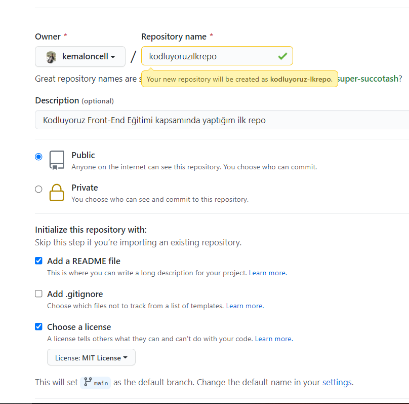

# Kodluyoruz Ilk Repo

Bu repo [Kodluyoruz](https:\kodluyoruz.org) Front-End Eğitiminde oluşturduğumuz ilk repo. içerisinde bir adet README dosyası, bir adette index.html barındırıyor



## Installatıon

öncelikle projeyi clonelayın. (Buraya sizin reponuzdan aldığınız link gelecek)

```text
git clone https://github.com/kemaloncell/kodluyoruzilkrepo.git
```

## Usage

Projeyi cloneladıktan sonra visual studio code programını açınız.
Linux için:

```text
cd kodluyoruzilkrepo
code .
```

## Contributing

pull requestler kabul edilir. Büyük değişiklikler için, lütfen önce neyi değiştirmek istediğiniz için bir tartışma açınız.

## Licence
[MIT](https://choosealicense.com/licenses/mit/)
